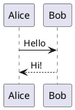

# md2pdf-plantuml

A high-performance **Markdown → PDF** conversion pipeline with automatic detection, extraction, and rendering of **PlantUML diagrams** — using Pandoc, XeLaTeX, and Java.

This script is designed for technical documentation workflows where source Markdown includes embedded system diagrams, architecture charts, or sequence diagrams written in PlantUML.

---

## 🚀 Key Capabilities

✅ Detects both PlantUML formats:

* Fenced: `plantuml … `
* Inline: `@startuml … @enduml`

✅ Renders diagrams as PNG in parallel (multiprocessing)
✅ Automatically injects missing `@startuml/@enduml` wrappers
✅ Replaces UML blocks with image references in the Markdown
✅ Converts Markdown to PDF with XeLaTeX and font fallback
✅ Resolves LaTeX `$` escape issues
✅ Applies page breaks via `---` (excluding YAML headers)
✅ Skips regeneration for already-rendered diagrams
✅ Logs all activity to help debugging

---

## 🧩 How It Works (Workflow Overview)

```
Markdown
  └─▶ Extract UML Code Blocks
        └─▶ Render UML → PNG (parallel)
              └─▶ Replace UML Blocks with Images in Markdown
                    └─▶ Fix LaTeX Escapes + Page Breaks
                          └─▶ Pandoc + XeLaTeX → PDF ✅
```

---

## 📁 Project Structure

```
.
├── md2pdf-plantuml.py     # Main script
├── book.md                # Input Markdown
├── libs/
│   └── plantuml.jar       # Required PlantUML engine
├── diagrams/              # Auto-generated PNG diagrams
├── book_tmp.md            # Safe processed Markdown passed to Pandoc
└── conversion.log         # Execution logs
```

> The `diagrams` folder is created automatically if missing ✅

---

## 🔧 Installation

### 1️⃣ Required Software

| Component     | Installation                                                                     |
| ------------- | -------------------------------------------------------------------------------- |
| Python ≥ 3.8  | [https://www.python.org/downloads/](https://www.python.org/downloads/)           |
| Java ≥ 8      | [https://adoptium.net/](https://adoptium.net/)                                   |
| Pandoc        | [https://github.com/jgm/pandoc/releases](https://github.com/jgm/pandoc/releases) |
| TeX (XeLaTeX) | Install TeX Live / MikTeX                                                        |

Verify availability:

```bash
pandoc --version
java -version
```

---

### 2️⃣ Download PlantUML Jar ✅

You **must** install the `plantuml.jar` manually:

🔗 [https://github.com/plantuml/plantuml/releases](https://github.com/plantuml/plantuml/releases)

Place it in:

```
./libs/plantuml.jar
```

---

## ⚙️ Configuration

Edit the beginning of `md2pdf-plantuml.py` to match your file paths:

```python
md_file = Path(r"F:\MD-Proj\book.md")
plantuml_jar = Path(r"F:\MD-Proj\libs\plantuml.jar")
output_dir = Path(r"F:\MD-Proj\diagrams")
temp_md = Path(r"F:\MD-Proj\book_tmp.md")
pandoc_exe = "pandoc"
log_file = Path(r"F:\MD-Proj\conversion.log")
```

---

## ▶️ Run the Conversion

```bash
python md2pdf-plantuml.py
```

If everything is configured, you’ll see:

✅ PNG diagrams in `/diagrams`
✅ A generated PDF next to `book.md`

---

## 🧪 Example UML Code



---

## 🧠 Code Explanation

This is a breakdown of the major components inside the script:

| Section                           | Purpose                                        |
| --------------------------------- | ---------------------------------------------- |
| `find_uml_blocks()`               | Detect UML source blocks in Markdown           |
| `ensure_wrapped()`                | Add missing `@startuml/@enduml`                |
| `process_uml()`                   | Convert PlantUML → PNG via Java                |
| `escape_unescaped_dollars()`      | Fix `$` for LaTeX math parser                  |
| `apply_page_breaks()`             | Convert `---` → `\newpage` (YAML-safe)         |
| Multiprocessing pool              | Fast parallel rendering                        |
| `run_pandoc_with_font_fallback()` | Multiple XeLaTeX font retries to avoid failure |
| Final Markdown rewriting          | Insert images into converted `.md`             |
| Logging system                    | Track and debug execution status               |

---

## 📌 Troubleshooting

| Issue                          | Solution                           |
| ------------------------------ | ---------------------------------- |
| PDF not created                | Ensure XeLaTeX is installed        |
| “java not found”               | Add Java to PATH                   |
| Diagrams missing               | Check `plantuml.jar` path          |
| `$` in text causes math errors | Script already escapes — check log |
| Font errors                    | Script falls back automatically    |

Check `conversion.log` for detailed traces.

---

## 🔮 Future Enhancements (Planned)

* ✅ CLI args instead of hardcoded config (`--input`, `--output`)
* ✅ Auto-download PlantUML if missing (GitHub API)
* ✅ SVG support
* ✅ Linux/macOS-compatible path auto-detection
* ✅ Custom Pandoc templates & themes

If you want, I can handle these upgrades next. 💡

---

## 📜 License

MIT License — free for personal and commercial use.
